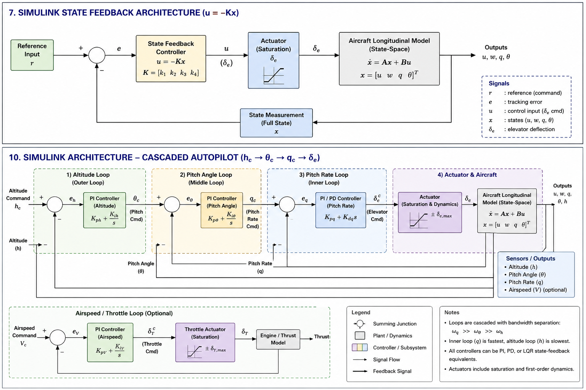
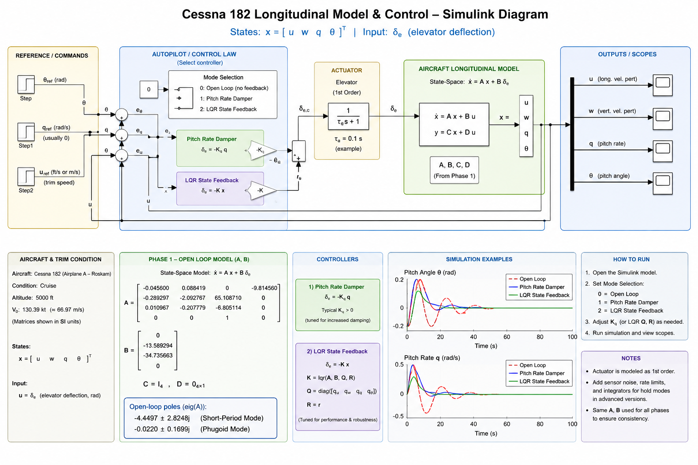

# Longitudinal Autopilot Architecture

## 1. Objective

The Phase 3 autopilot converts pilot or guidance commands into aircraft control-surface commands while maintaining stable closed-loop dynamics.

A representative longitudinal command chain is

$$\boxed{ h_c \rightarrow \theta_c \rightarrow q_c \rightarrow \delta_e }$$

with a separate throttle loop available for airspeed regulation.

---

## 2. Layered Architecture

The autopilot can be organized into four conceptual layers:

```text
Guidance / Command
        |
        v
Altitude or Flight-Path Loop
        |
        v
Pitch-Attitude Loop
        |
        v
Pitch-Rate / Stability Loop
        |
        v
Elevator / Actuator
        |
        v
Aircraft Dynamics
        |
        +---------------- Feedback ----------------+
```

This architecture separates slow trajectory variables from faster rotational dynamics.

---

## 3. Inner Pitch-Rate Loop

The innermost loop regulates pitch rate.

A simple feedback form is

$$\delta_e=-K_qq$$

For command following it may be expressed in terms of pitch-rate error,

$$e_q=q_c-q$$

A controller then maps $e_q$ into elevator demand.

The inner loop should provide rapid damping and should be verified before outer loops are closed.

---

## 4. Pitch-Attitude Loop

Define attitude error

$$e_\theta=\theta_c-\theta$$

The attitude controller produces an inner-loop command such as

$$q_c=K_\theta e_\theta$$

for a simple proportional architecture.

More advanced implementations can use state feedback or compensators.

The key requirement is that the attitude loop should be slower than the already-stabilized inner pitch-rate loop.

---

## 5. Altitude Loop

Define

$$e_h=h_c-h$$

The altitude loop produces a pitch-attitude or flight-path command.

For a simple architecture,

$$\theta_c=K_he_h$$

subject to command limiting.

In a more complete aircraft energy-control architecture, altitude and airspeed cannot be treated as completely independent because elevator and thrust jointly affect the aircraft's energy state. Phase 3 can begin with a simplified longitudinal architecture, but that simplification must be documented.

---

## 6. Airspeed / Throttle Loop

If throttle dynamics are included, define

$$e_V=V_c-V$$

A simple throttle controller may take the form

$$\delta_T = K_{pV}e_V + K_{iV}\int e_Vdt$$

Throttle commands must be limited to the valid range used by the aircraft model.

The exact implementation depends on whether the Phase 3 plant includes throttle as an input.

---

## 7. State-Feedback Architecture

Instead of independent classical loops, the inner aircraft controller may use

$$u=-Kx+Nr$$

LQR can provide the state-feedback matrix $K$.

The outer guidance loop then generates appropriate reference commands for the controlled inner system.

This produces the conceptual hierarchy

```text
Altitude Command
      |
      v
Guidance / Outer Loop
      |
      v
State Reference
      |
      v
LQR / State Feedback
      |
      v
Elevator (+ Throttle if modeled)
      |
      v
Aircraft
      |
      v
State Feedback
```

---

## 8. Bandwidth Separation

Nested-loop design requires the inner dynamics to respond faster than the outer dynamics.

Conceptually,

$$\omega_{\text{inner}} > \omega_{\text{attitude}} > \omega_{\text{altitude}}$$

No universal numerical ratio should be imposed without examining the actual aircraft model.

If the loops operate at similar time scales, interaction can create:

- oscillation,
- poor damping,
- excessive control effort,
- sensitivity to delays,
- difficult tuning.

---

## 9. Command Limiting

Outer-loop commands should not demand physically unreasonable aircraft states.

For example,

$$\theta_{c,\min} \leq \theta_c \leq \theta_{c,\max}$$

Similarly, elevator demand should satisfy the model's actuator limits.

Command limiting is especially important during large altitude steps because a linear controller designed around trim is intended for local operation.

---

## 10. Simulink Architecture

A recommended Simulink organization is:

```text
Command Generator
      |
      v
Outer-Loop Controller
      |
      v
Reference Limiter
      |
      v
State-Feedback / LQR Controller
      |
      v
Actuator Model / Saturation
      |
      v
Linear Aircraft Plant
      |
      v
Sensors / State Outputs
      |
      +------ feedback ------+
```

Subsystems should be used so that guidance, controller, actuator, plant, and analysis logic remain clearly separated.

---

## 11. Operating-Point Assumption

The Phase 3 aircraft model is linearized about a selected flight condition.

Therefore,

$$x=x_0+\delta x$$

and

$$u=u_0+\delta u$$

The controller operates primarily on perturbation variables.

This distinction is important when connecting the model to absolute quantities such as altitude, true airspeed, elevator position, or FlightGear variables.

---

## 12. Fault and Safety Considerations

Phase 3 is a portfolio simulation, not a flight-certified implementation. Nevertheless, the architecture should acknowledge practical control-system concerns:

- actuator saturation,
- sensor failure,
- invalid commands,
- integrator windup,
- excessive attitude commands,
- mode transitions,
- controller engagement/disengagement,
- state-estimation validity.

These can be documented as future implementation requirements even if they are not all modeled in Phase 3.

---

## 13. Verification Sequence

Close the loops progressively:

1. verify the open-loop plant,
2. verify the pitch-rate loop,
3. verify the attitude loop,
4. verify altitude tracking,
5. add airspeed/throttle control if included,
6. test combined commands,
7. test disturbances,
8. check actuator limits,
9. compare MATLAB and Simulink results.

This staged approach makes controller problems easier to isolate and gives the repository a defensible engineering workflow.

---

## 14. Connection to Automatic Landing

This Phase 3 architecture later becomes the low-level control foundation for automatic landing.

A landing guidance system can eventually generate commands for:

- localizer tracking,
- glideslope tracking,
- approach speed,
- flare,
- de-crab,
- runway alignment.

Those guidance commands should feed verified lower-level control loops rather than directly commanding arbitrary control-surface motion.

---

## Architecture Diagram

The following figure summarizes the Phase 3 Simulink state-feedback and cascaded autopilot architecture:



## Longitudinal Model and Controller

The following figure summarizes Cessna 182 aircraft




