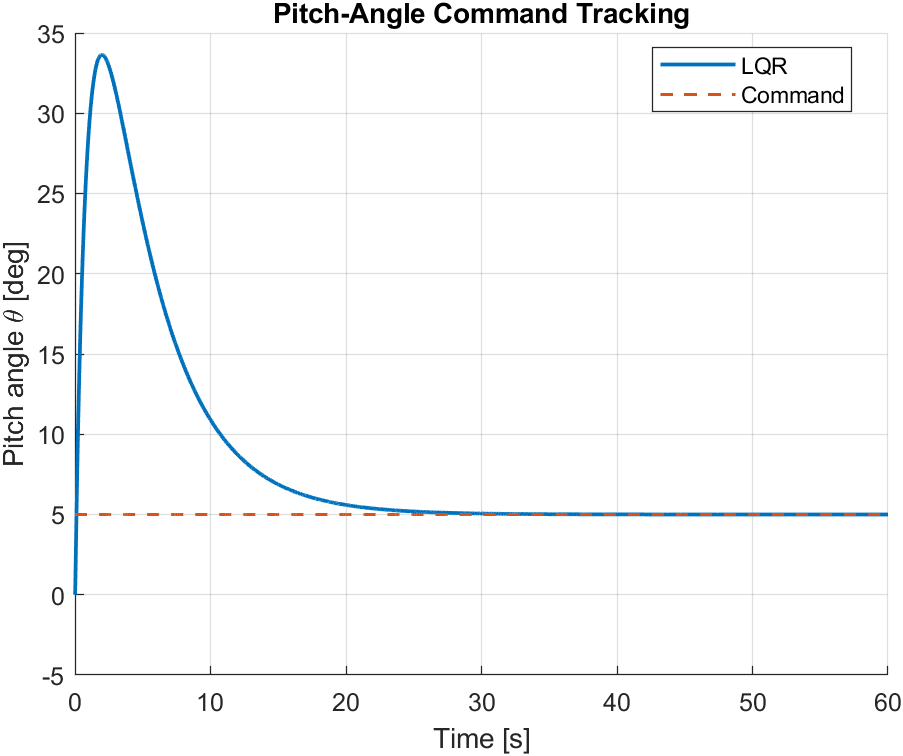
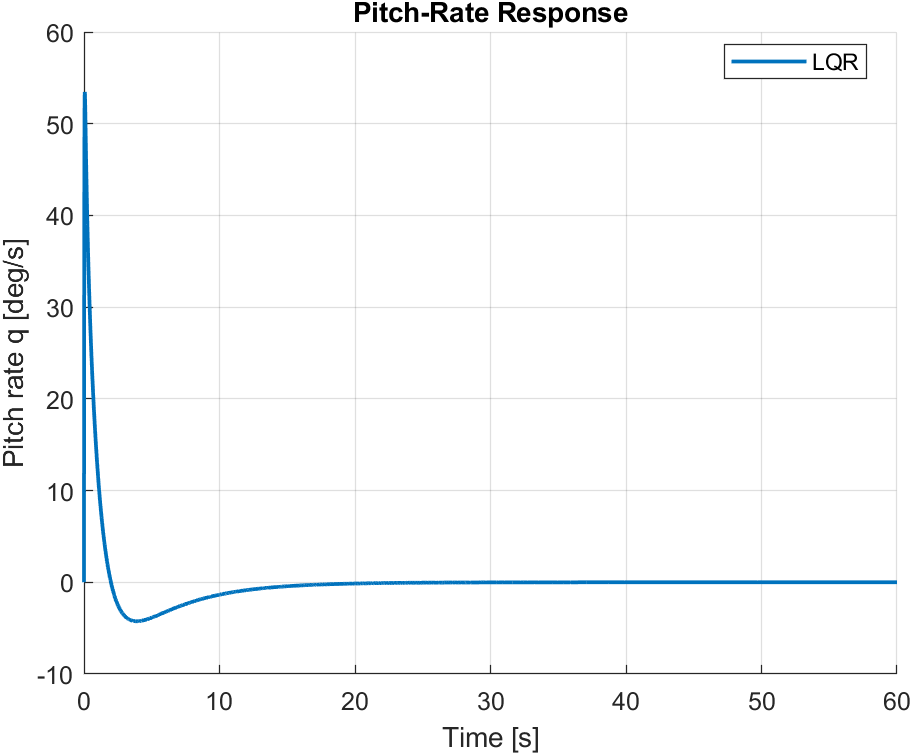
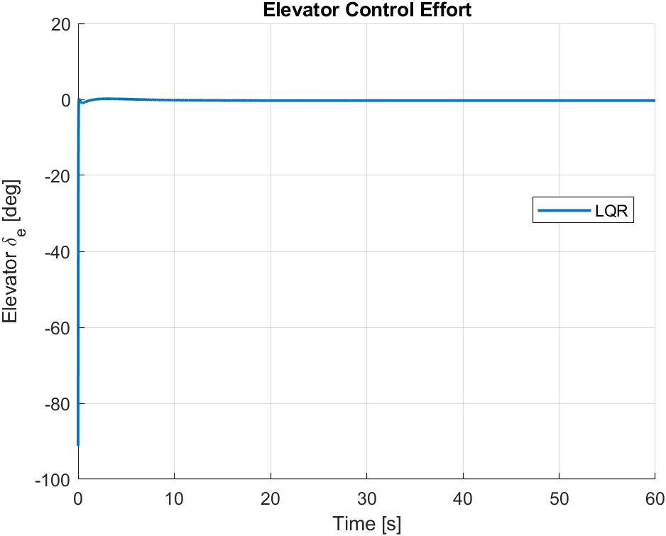
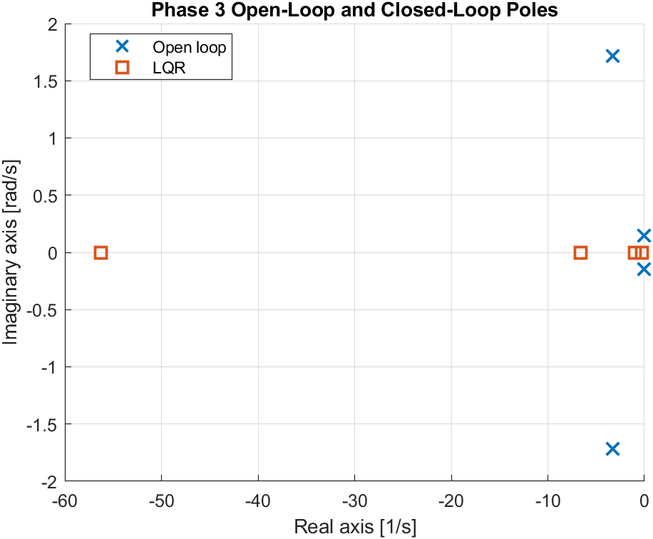

# Phase 3 — Results and Engineering Assessment

> **Status:** Results template. Replace all `TBD` entries with values generated by the final MATLAB/Simulink implementation. Do not claim performance that has not been simulated and verified.

## 1. Objective

Phase 3 demonstrates the progression from the longitudinal aircraft model and stability-augmentation work into a closed-loop autopilot using state feedback and/or LQR.

The final results should establish:

- closed-loop stability,
- improved dynamic behavior,
- command-following capability,
- acceptable control effort,
- reproducibility between MATLAB and Simulink,
- a documented basis for transition to nonlinear 6-DOF modeling.

---

## 2. Test Configuration

| Parameter | Value |
|---|---|
| Aircraft/model | TBD |
| Operating condition | TBD |
| Trim airspeed | TBD |
| Trim altitude | TBD |
| State vector | TBD |
| Control inputs | TBD |
| Simulation duration | TBD |
| MATLAB version | TBD |
| Simulink version | TBD |

---

## 3. Open-Loop Baseline

Record the open-loop eigenvalues.

| Mode / Pole | Eigenvalue | $\omega_n$ | $\zeta$ | Interpretation |
|---|---|---:|---:|---|
| 1 | TBD | TBD | TBD | TBD |
| 2 | TBD | TBD | TBD | TBD |
| 3 | TBD | TBD | TBD | TBD |
| 4 | TBD | TBD | TBD | TBD |

Discuss:

- short-period behavior,
- phugoid behavior,
- damping,
- dominant time scales,
- reason an autopilot or stability augmentation is beneficial.

---

## 4. Controllability

The controllability matrix is

$$\mathcal{C} = \begin{bmatrix} B&AB&A^2B&\cdots&A^{n-1}B \end{bmatrix}$$

Measured rank:

$$\operatorname{rank}(\mathcal{C})=\text{TBD}$$

Number of states:

$$n=\text{TBD}$$

**Assessment:** TBD.

---

## 5. State-Feedback Design

Selected feedback law:

$$u=-Kx+Nr$$

or the exact implemented equivalent.

Final state-feedback gain:

$$K= \begin{bmatrix} \text{TBD} \end{bmatrix}$$

Selected/achieved closed-loop poles:

| Pole | Value | $\omega_n$ | $\zeta$ |
|---|---|---:|---:|
| 1 | TBD | TBD | TBD |
| 2 | TBD | TBD | TBD |
| 3 | TBD | TBD | TBD |
| 4 | TBD | TBD | TBD |

### Engineering interpretation

TBD: Explain how the closed-loop poles differ from the open-loop modes and why the new locations are acceptable.

---

## 6. LQR Design

The LQR cost function is

$$J= \int_0^\infty \left( x^TQx+u^TRu \right)dt$$

Final weighting matrices:

$$Q= \begin{bmatrix} \text{TBD} \end{bmatrix}$$

and

$$R= \begin{bmatrix} \text{TBD} \end{bmatrix}$$

Final LQR gain:

$$K_{\mathrm{LQR}} = \begin{bmatrix} \text{TBD} \end{bmatrix}$$

### Weight-selection rationale

TBD: Explain the physical meaning of the selected state and control penalties.

---

## 7. LQR Tuning Comparison

| Design | Main change | Settling time | Overshoot | Peak elevator | Assessment |
|---|---|---:|---:|---:|---|
| Baseline | TBD | TBD | TBD | TBD | TBD |
| Case A | TBD | TBD | TBD | TBD | TBD |
| Case B | TBD | TBD | TBD | TBD | TBD |
| Final | TBD | TBD | TBD | TBD | TBD |

### Selection

TBD: State why the final design was chosen.

---

## 8. Pitch-Attitude Tracking

Command:

$$\theta_c=\text{TBD}$$

Results:

| Metric | Result |
|---|---:|
| Rise time | TBD |
| Settling time | TBD |
| Overshoot | TBD |
| Steady-state error | TBD |
| Peak pitch rate | TBD |
| Peak elevator | TBD |

Insert figure:

```markdown

```

### Interpretation

TBD.

---

## 9. Altitude Tracking

Command:

$$h_c=\text{TBD}$$

Results:

| Metric | Result |
|---|---:|
| Rise time | TBD |
| Settling time | TBD |
| Overshoot | TBD |
| Steady-state error | TBD |
| Peak pitch attitude | TBD |
| Peak elevator | TBD |

Insert figure:

```markdown

```

### Interpretation

TBD: Explain the transient, steady-state behavior, and relationship between altitude and pitch commands.

---

## 10. Pitch-Rate Response

Insert:

```markdown

```

Discuss:

- damping,
- maximum pitch rate,
- convergence,
- inner-loop behavior.

**Assessment:** TBD.

---

## 11. Elevator Control Effort

Insert:

```markdown

```

Document the assumed elevator constraint:

$$|\delta_e|\leq\text{TBD}$$

Observed maximum:

$$|\delta_e|_{\max}=\text{TBD}$$

**Assessment:** TBD.

---

## 12. Closed-Loop Pole Plot

Insert:

```markdown

```

Compare open-loop and closed-loop pole locations and identify the movement of the short-period and phugoid modes.

---

## 13. Disturbance-Rejection Test

Disturbance/initial perturbation:

TBD.

| Metric | Result |
|---|---:|
| Maximum deviation | TBD |
| Recovery time | TBD |
| Peak elevator | TBD |
| Final error | TBD |

### Interpretation

TBD.

---

## 14. MATLAB versus Simulink

Run the same initial conditions, commands, controller gains, and model parameters in both implementations.

| Quantity | MATLAB | Simulink | Difference |
|---|---:|---:|---:|
| Peak $\theta$ | TBD | TBD | TBD |
| Peak $q$ | TBD | TBD | TBD |
| Settling time | TBD | TBD | TBD |
| Peak $\delta_e$ | TBD | TBD | TBD |

Any discrepancy should be investigated for:

- solver differences,
- sample time,
- initial conditions,
- signal units,
- saturation,
- sign conventions,
- block implementation.

---

## 15. Requirements / Evidence Matrix

| ID | Verification objective | Evidence | Status |
|---|---|---|---|
| P3-01 | Closed-loop system is stable | Pole/eigenvalue analysis | TBD |
| P3-02 | Pitch command is tracked | Pitch-response plot | TBD |
| P3-03 | Altitude command is tracked | Altitude-response plot | TBD |
| P3-04 | Control demand respects assumed limits | Elevator plot | TBD |
| P3-05 | LQR tuning trade is documented | Tuning table | TBD |
| P3-06 | MATLAB and Simulink are consistent | Comparison table | TBD |

---

## 16. Limitations

The Phase 3 conclusions should be interpreted within the model assumptions.

Potential limitations include:

- linearization about a single operating condition,
- simplified actuator dynamics,
- direct availability of states,
- simplified atmosphere/disturbance model,
- absence of sensor dynamics,
- absence of structural flexibility,
- no full flight-envelope gain scheduling,
- no certification-level verification.

Only retain limitations that apply to the final implementation.

---

## 17. Phase 3 Conclusion

Complete this section after the final simulations.

A suitable conclusion should answer:

1. Was the aircraft controllable at the selected operating point?
2. Did state feedback/LQR stabilize and improve the required modes?
3. Did the autopilot track its commands?
4. Was control effort acceptable under the documented assumptions?
5. Which controller was selected and why?
6. What limitations remain?
7. What is carried into Phase 4?

---

## 18. Transition to Phase 4

Phase 4 replaces the purely linear plant with a nonlinear six-degree-of-freedom aircraft model,

$$\dot{x}=f(x,u,t)$$

The nonlinear aircraft will then be trimmed and locally linearized,

$$\delta\dot{x}=A\delta x+B\delta u$$

allowing the Phase 3 control methodology to be compared against and eventually applied to the nonlinear simulation.

This provides traceability from linear flight dynamics and autopilot design to the nonlinear aircraft model required for the later automatic-landing demonstration.
